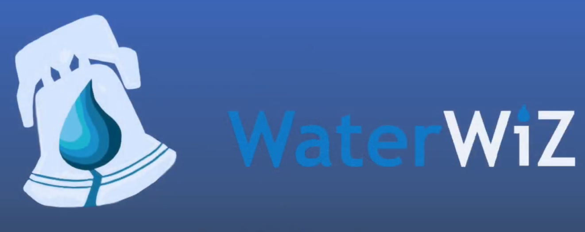

# WaterWiZ

## Winner: Freshman Challenge Award at Philly Codefest 2020

### Demo

 
## How we built it
WaterWiZ was developed entirely from scratch using HTML, CSS, Javascript, and the Google charts and maps APIs.

## Inspiration
As humans, water is essential to everyday life and the environment. Access to safe water has become even more critical especially as we're all stuck at home during this pandemic. Having access to good quality water can also minimize medical expenses for our family and pets, and help maintain the efficiency of appliances at home.

Unfortunately, access to clean water can be an issue for many. Contaminated water occurs more often than you think. There have been several issues with water quality recently in places like Philadelphia and Montgomery County. Water quality information isn’t easily accessible to the public and can be very hard to find. Even if you do find the local water quality report for your area, it tends to be very long and confusing. That's why we created WaterWiZ!

Visit us at phillywaterwiz.com!

## What it does
WaterWiZ gives people easy access to otherwise hard to find water statistics. Our website collects and stores data on 22 water systems and treatment plants, covering 4 water suppliers in the greater Philadelphia region. Using our map page, you can find the closest water system that serves your community. Our water suppliers webpage has a list of all the suppliers and the areas they serve organized by counties and water systems.

At WaterWiZ, we believe everyone has a right to know if their water is safe. Our website has a simple and straightforward organization that makes it easy for anyone to get instant data from their local water system and see if their water is safe to use. Not only do we provide easy access to this data, but the page has ideal values listed alongside the actual reported data. We have also included simple explanations about what the critical parameters and values mean for each of the recorded statistics so that everyone can understand what's in their water.

## Challenges we ran into
Since we are all freshmen at Drexel starting college remotely, forming a team was hard and took a long time as we didn't know each other before this project.

Water quality information is scarce and not easily accessible, so the biggest challenge we faced in building WaterWiZ was acquiring all the critical water parameters and statistics for each county and system. We found that even when we called each water supplier directly to get information about water quality, they were unable to give us this information quickly and took a while to get back to us. We spent several hours as a team collecting and organizing all the data and parameters for WaterWiZ to bridge the critical need to provide updated water quality information so that anyone can see what's in their water.

## Accomplishments that we are proud of
Despite some of the initial hurdles we faced in getting started, Team WaterWiZ is very pleased to have developed a project that will hopefully contribute to the well-being of every individual, family, and community. The long hours that went into research and developing the website are well worth it knowing that anyone can now easily check if their water is safe to use. We are also proud of the unique design of our website and the organization of the data and parameters on our pages.

## What we learned
We learned a lot about what is actually in the water that we consume on a daily basis, who supplies water in each area, and what it means for water to be safe to use according to EPA standards. This was the first software project for some of us, so we also learned how to work with a team on GitHub and how to create and host a website from scratch.

## What's next for WaterWiZ
Our site allows us to easily plug-in data so we can keep it running with up-to-date water data. We hope to directly work with each water supplier to provide real-time updates about water quality information. We also hope to make this a nation-wide website that can automatically trigger notifications to every house hold in a certain area when there is an issue with water quality.
